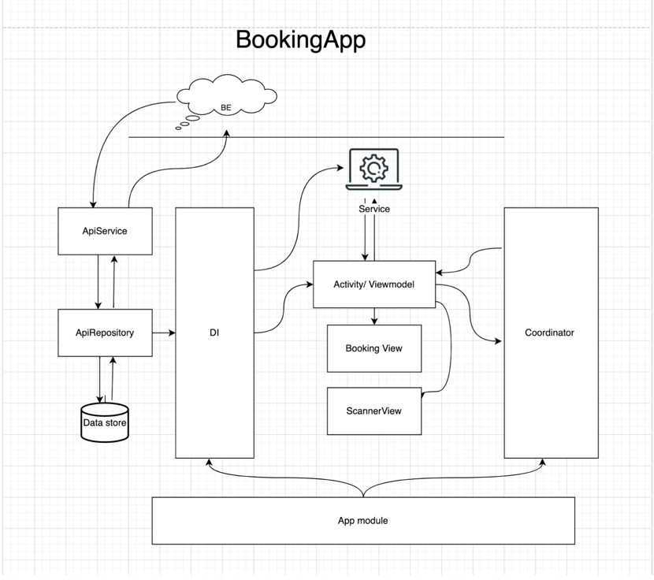
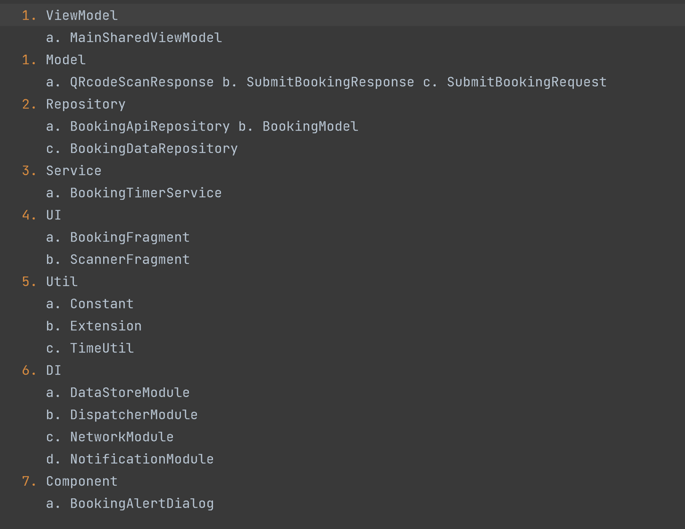
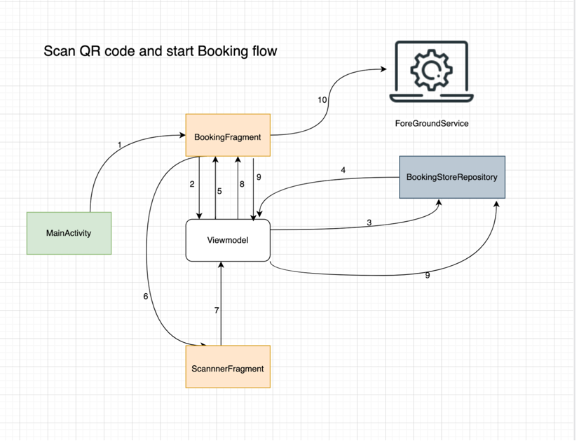

# iamatulkumar-QR Code Scanner With Timer Fore Ground Service
## Description: 
Scan Sample QR code will start a foreground timer service, Scan again to stop timer service

## Component: 
1. MVVM architecture pattern
2. Retrofit, 
3. kotlin Flow,
4. Dagger hilt
5. Mockk Kotlin
6. Jetpack DataStore
7. Notification manager
8. Camera permission

## HLD

## Package Structure
### → BookingApplication → MainActivity

## Scan QR code and start forground service

1. Open Application → show booking fragment
2. Fetch booking details from viewmodel
3. ViewModel fetches booking details from the booking repository
4. Return booking details if already booking available, return empty if no booking
found
5. Update booking fragment state and show no booking found state
6. On clicking the scan button → open ScannerFragment
7. After successfully scanning → update response in a view model
8. ViewModel update state in booking fragment
9. Booking fragment → ViewModel to save booking details
10. start foreground service
